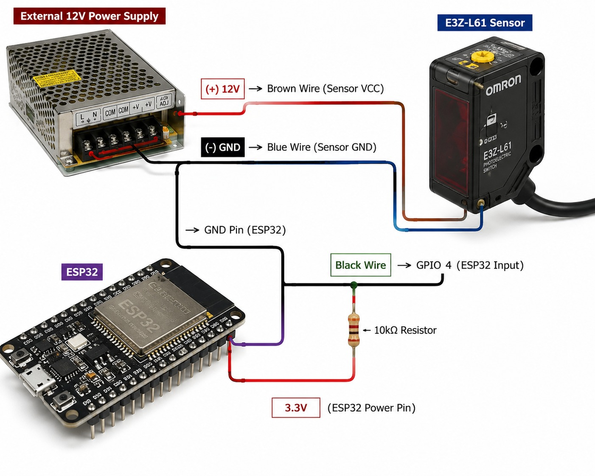

---

# ESP32 RPM Counter using E3Z-L61 Photoelectric Sensor

## Project Overview

This project is developed to measure the **RPM (Revolutions Per Minute)** of a rotating wheel using an **ESP32** and an **OMRON E3Z-L61 Photoelectric Sensor**.

A small reflective sticker is attached to the rotating wheel. Each time the sticker passes in front of the sensor, the sensor generates a pulse. The ESP32 counts these pulses and calculates the RPM.

---

# Hardware Required

* ESP32 Development Board
* OMRON E3Z-L61 Photoelectric Sensor
* 12V DC Power Supply (for the sensor)
* Reflective Sticker
* 10kΩ Resistor
* Jumper Wires
* Breadboard (for testing)

---

# Sensor Specifications

**Sensor Model:** OMRON E3Z-L61

* Sensor Type: Photoelectric Sensor
* Detection Method: Reflective
* Supply Voltage: 12V – 24V DC
* Output Type: NPN Open Collector
* Response Time: 1 ms
* Protection Rating: IP67
* Cable Wires:

  * Brown → VCC (12–24V)
  * Blue → GND
  * Black → Output Signal

---

# Working Principle

1. A reflective sticker is attached to the rotating wheel.
2. The sensor detects the sticker whenever it passes in front of the sensor.
3. One pulse is generated for each rotation.
4. The ESP32 counts the pulses.
5. The RPM is calculated and displayed or sent to the cloud.

---

# Sensor Limitations

* Requires an external **12V DC** power supply.
* Cannot be powered directly from the ESP32.
* The sensor must be properly aligned with the reflective sticker.
* A loose sensor mounting can affect RPM accuracy.
* Dust or dirt on the sensor or sticker may reduce detection performance.
* The NPN output requires a **3.3V pull-up resistor (10kΩ)** when connecting to the ESP32.

---

# Wiring Connection

| Sensor Wire | Connect To                     |
| ----------- | ------------------------------ |
| Brown       | +12V Power Supply              |
| Blue        | GND (Common Ground with ESP32) |
| Black       | ESP32 GPIO 4                   |

**Pull-up Resistor**

* 10kΩ resistor between **GPIO 4** and **3.3V**.

---

## Circuit Diagram



---

# RPM Calculation

The ESP32 measures the number of pulses from the sensor.

**Formula**

```
RPM = (Pulse Count × 60) / Time (seconds)
```

Example:

```
120 pulses in 1 second

RPM = 120 × 60

RPM = 7200
```

---

# Applications

* Industrial Machine Monitoring
* Conveyor Systems
* Motor Speed Measurement
* Wheel RPM Measurement
* IoT Monitoring System

---

# Future Improvements

* Send RPM data to the Cloud
* Web Dashboard
* Data Logging
* High RPM Alarm
* Real-time Monitoring

---

# References

* OMRON E3Z-L61 Datasheet
* ESP32 Documentation

---

